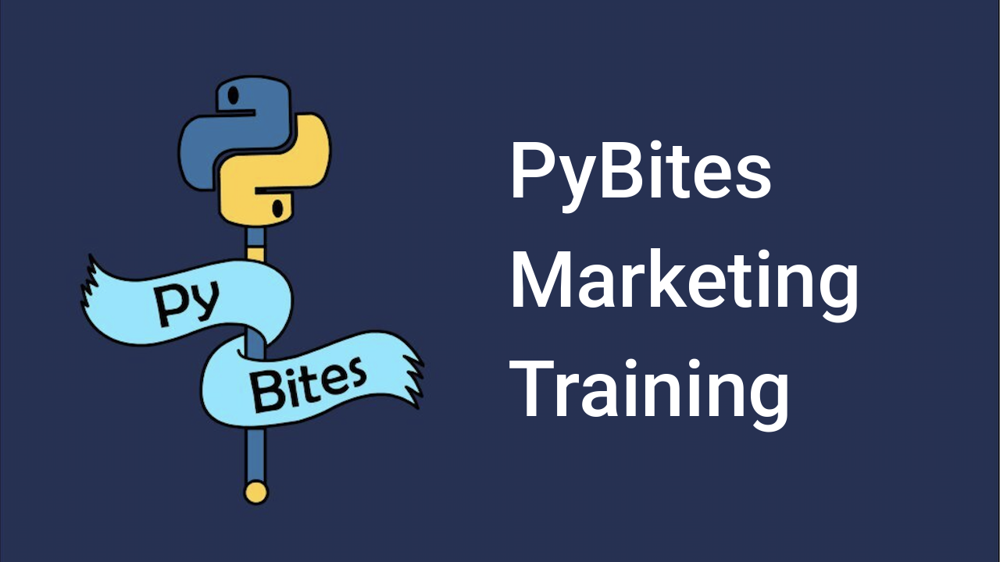

# PyBites YouTube Thumbnail creator

Simple script that uses [Pillow](https://pillow.readthedocs.io/en/stable/) to generate thumbnail images for [our YouTube channel](https://www.youtube.com/channel/UCBn-uKDGsRBfcB0lQeOB_gA).

## Setup

Clone the repo and use uv:

```
git clone git@github.com:bbelderbos/youtube-thumbnails.git
cd youtube-thumbnails
uv sync
```

## Usage

To start simple the script relies on short titles it splits by a pipe character, for example:

```
uv run thumbs.py "PyBites|Marketing|Training"
```

... creates this image in the `images/` output folder:



---

Special shoutout to [Sarah Gencarelli](https://www.pybitespodcast.com/1501156/8128624-017-the-importance-of-creativity-as-a-developer) for the awesome thumbnail base template design!
