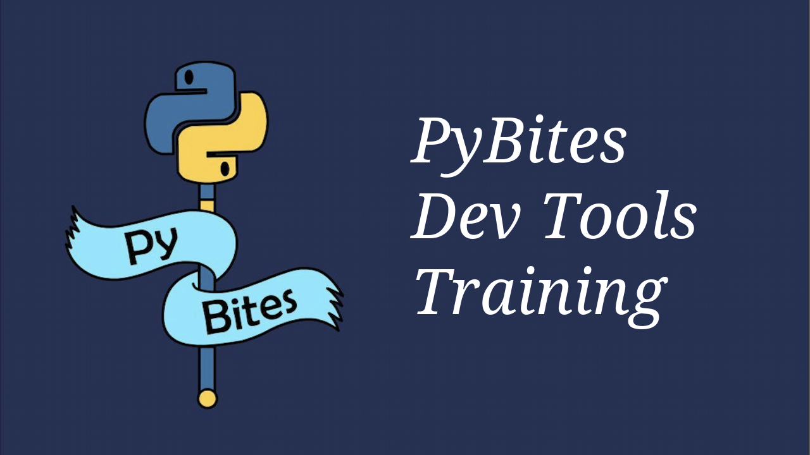

# PyBites YouTube Thumbnail creator

Simple script that uses [Pillow](https://pillow.readthedocs.io/en/stable/) to generate thumbnail images for [our YouTube channel](https://www.youtube.com/channel/UCBn-uKDGsRBfcB0lQeOB_gA).

## Setup

Make a virtual environment, enable it and install `Pillow`:

```
python3.9 -m venv venv && source venv/bin/activate
pip install -r requirements.txt
```

## Usage

To start simple the script relies on short titles it splits by newline, for example:

```
python script.py "PyBites\nDev Tools\nTraining"
```

... creates this image in the `images/` output folder:



---

Special shoutout to [Sarah Gencarelli](https://www.pybitespodcast.com/1501156/8128624-017-the-importance-of-creativity-as-a-developer) for the awesome thumbnail base template design!
